# SDGsprogram_5.0 System Architecture

本文件依目前程式碼撰寫，重點放在 FastAPI 後端、靜態前端、題庫資料流、遊戲紀錄、教師後台、Excel 題庫匯入與部署方式。

## 1. 系統總覽

SDGsprogram_5.0 是一套 SDGs Pecha Kucha 卡片配對學習系統。學生登入後選擇 SDG 與 CEFR 難度，經過 loading guide 進入卡片配對遊戲；完成後進入 finish 頁，頁面會從資料庫抓同一個 SDG 與難度的稿子，讓學生看稿錄音、下載自己的錄音、完成單字填空，最後查看排行榜與掌聲動畫。教師與管理者可在後台維護題庫、匯入 Excel、查看學生成績與管理使用者。

主要技術：

- Backend: FastAPI, Pydantic, JWT, SQLite/PostgreSQL adapter, optional Redis rate limit.
- Frontend: static HTML/CSS/JavaScript, centralized API client in `frontend/js/api.js`.
- Database: local SQLite `sql/app.db` by default, PostgreSQL when `DATABASE_URL` is set.
- Deployment: Railway backend, Vercel static frontend from `dist/`.
- Email: Resend API when `RESEND_API_KEY` and sender are configured.
- Excel import: `openpyxl` when available, with a stdlib `.xlsx` XML fallback.

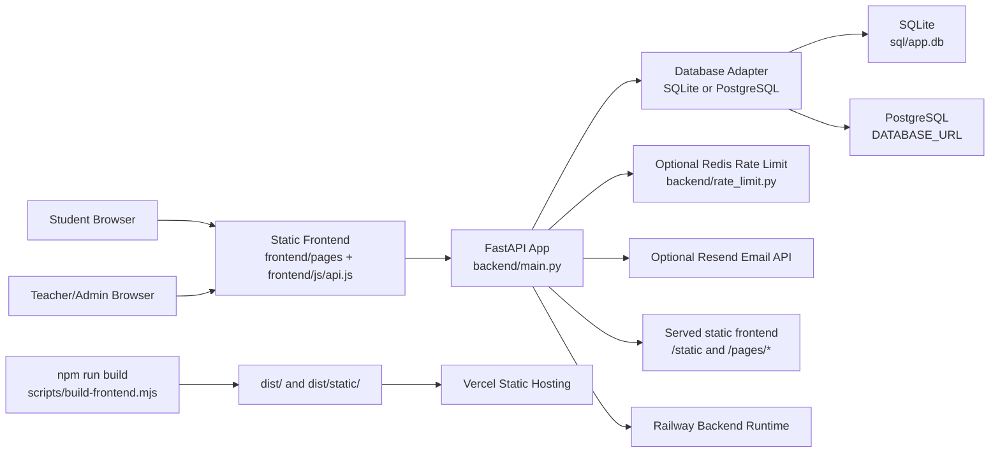

## 2. Repository Layout

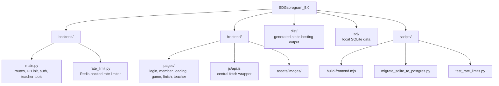

## 3. Runtime Architecture

Backend initialization happens at import time in `backend/main.py`:

1. Load `.env`.
2. Configure paths, CORS, JWT, rate limiting, email settings.
3. Choose database engine:
   - no `DATABASE_URL`: SQLite at `sql/app.db`.
   - with `DATABASE_URL`: PostgreSQL through `psycopg`.
4. Run `init_db()` to create or update required tables and seed default SDG/difficulty/part rows.
5. Mount frontend assets under `/static`.
6. Register page routes and API routes.
7. Optionally create an initial admin from environment variables.

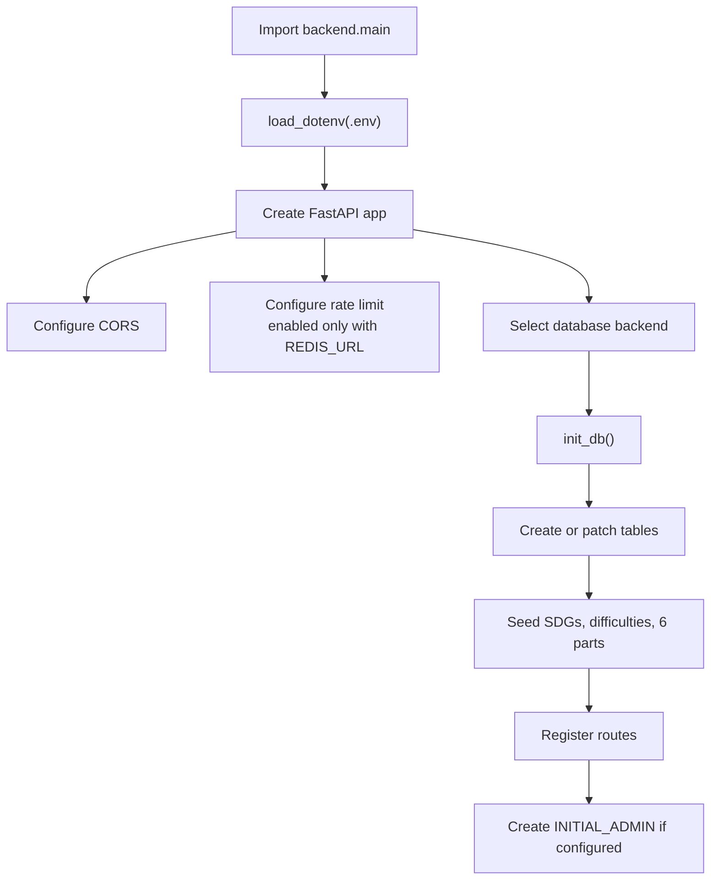

## 4. Frontend Page Flow

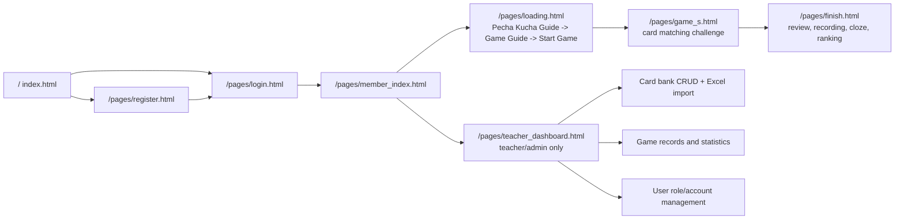

Frontend state is split between browser storage layers:

- `localStorage.user`: normalized login session and JWT.
- `localStorage.selected_sdg`: last selected SDG.
- `localStorage.selected_difficulty`: last selected difficulty, currently `A2`, `A1`, or `B1`.
- `sessionStorage.current_sdg`: SDG for the active run.
- `sessionStorage.current_difficulty`: difficulty for the active run.
- `sessionStorage.current_session_id`: backend game session id after game save.
- `sessionStorage.current_script_review`: script payload prepared by game page or refreshed from database on finish page.
- `sessionStorage.finish_super_skip`: teacher/admin super review mode flag.

## 5. Backend API Surface

| Area | Route | Purpose | Auth |
| --- | --- | --- | --- |
| Pages | `GET /` | Serve frontend index | No |
| Pages | `GET /pages/{page_name}` | Serve static HTML page from `frontend/pages` | No |
| Health | `GET /health` | App, DB, rate-limit status | No |
| Auth | `POST /auth/send-otp` | Create email OTP and send mail | No |
| Auth | `POST /auth/verify-otp` | Verify OTP | No |
| Auth | `POST /auth/register` | Register verified student | No |
| Auth | `POST /auth/login` | Login and return JWT | No |
| Auth | `GET /auth/me` | Get current user profile | JWT |
| Content | `GET /content/options` | Active SDGs and difficulties | No |
| Content | `GET /content/parts` | Public content tree, optional SDG filter | No |
| Game | `GET /game/content` | DB script/cards by SDG and difficulty | JWT |
| Game | `POST /game/start` | Create active game session | JWT |
| Game | `POST /game/part` | Upsert part result | JWT |
| Game | `POST /game/end` | Mark session completed | JWT |
| Game | `GET /game/results/{session_id}` | Student result and leaderboard | JWT |
| Teacher | `GET /teacher/content` | Full editable content tree | teacher/admin |
| Teacher | `POST /teacher/import-excel` | Import `.xlsx` question bank | teacher/admin |
| Teacher | `POST /teacher/import-json` | Import one mini material `.json` file | teacher/admin |
| Teacher | `GET /teacher/game-records` | Attempts and aggregate part stats | teacher/admin |
| Teacher | `DELETE /teacher/game-records/{session_id}` | Delete an attempt | teacher/admin |
| Teacher | `GET /teacher/users` | User list and overview | teacher/admin |
| Teacher | `PATCH /teacher/users/{user_id}/role` | Change user role | teacher/admin, admin for admin role |
| Teacher | `DELETE /teacher/users/{user_id}` | Delete user and their records | teacher/admin, admin for admin users |
| Teacher | `POST /teacher/sdgs` | Upsert SDG option | teacher/admin |
| Teacher | `POST /teacher/difficulties` | Upsert difficulty | teacher/admin |
| Teacher | `POST /teacher/parts` | Upsert SDG part | teacher/admin |
| Teacher | `POST /teacher/sub-topics` | Upsert subtopic | teacher/admin |
| Teacher | `POST /teacher/cards` | Upsert sentence card | teacher/admin |
| Teacher | `DELETE /teacher/sdgs/{sdg_level}` | Delete SDG and descendants | teacher/admin |
| Teacher | `DELETE /teacher/parts/{part_id}` | Delete part and descendants | teacher/admin |
| Teacher | `DELETE /teacher/sub-topics/{sub_topic_id}` | Delete subtopic and cards | teacher/admin |
| Teacher | `DELETE /teacher/cards/{card_id}` | Delete one card | teacher/admin |

## 6. Data Model

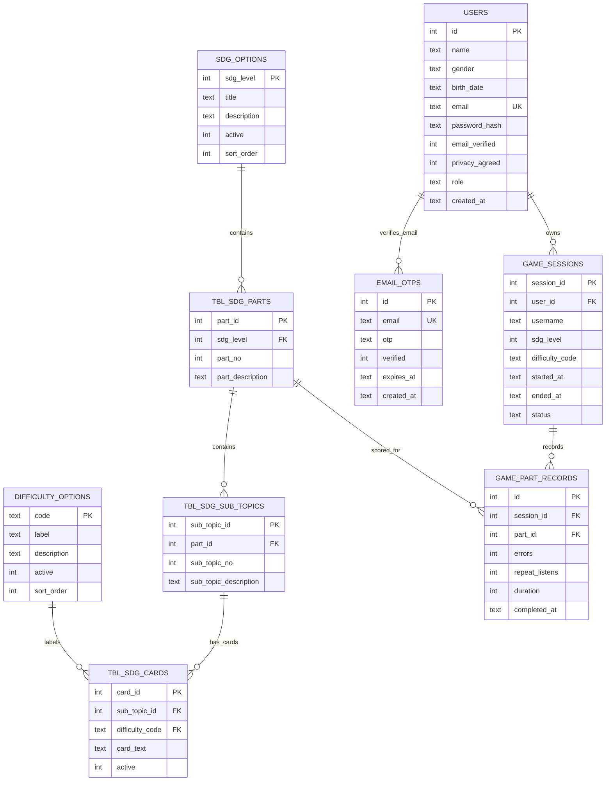

Important uniqueness rules:

- `users.email` is unique.
- `email_otps.email` is unique.
- `tbl_sdg_parts` is unique by `(sdg_level, part_no)`.
- `tbl_sdg_sub_topics` is unique by `(part_id, sub_topic_no)`.
- `tbl_sdg_cards` is unique by `(sub_topic_id, difficulty_code)`.
- `game_part_records` is unique by `(session_id, part_id)`.

Current difficulty vocabulary is `A2`, `A1`, and `B1`. Existing legacy `A2-2` rows, if present in an older local database, are marked inactive during initialization so they do not appear as selectable options.

## 7. Student Game Flow

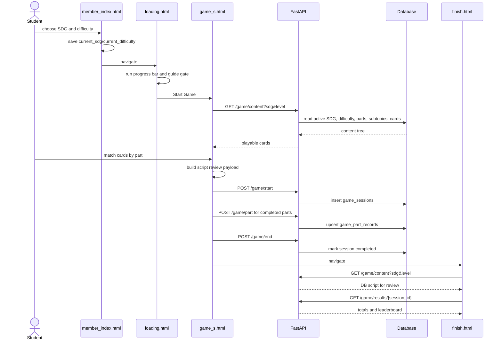

Finish page behavior:

- Step 1: Review & Record. The page renders the full script and records audio locally with `MediaRecorder`.
- Step 2: Word Check. The page generates five cloze questions from the script and can download an HTML result.
- Step 3: Ranking. The page renders leaderboard rows from `/game/results/{session_id}` and starts the applause animation.
- Recording is currently client-side only. `prepareRecordingPayload()` documents the planned future payload for DB storage or AI scoring, but no audio is uploaded to the server yet.

## 8. Teacher Material Import Flow

Teachers can upload the provided Excel question bank from the teacher dashboard. The parser reads workbook sheets, identifies SDG sheets and difficulty columns, then upserts the question bank. The mini JSON path supports one SDG and one difficulty per file, using the same import pipeline after validation.

Expected workbook shape:

- Sheet title or first row contains `SDG <number>`.
- First row has difficulty headers such as `A2`, `A1`, and `B1`.
- Rows include Part number, part description, subtopic number, subtopic title/description, and card text under each difficulty column.

Mini JSON shape:

```json
{
  "schema_version": 1,
  "sdg": {
    "level": 4,
    "title": "Quality Education",
    "description": "Quality Education"
  },
  "difficulty": {
    "code": "A2",
    "label": "A2"
  },
  "parts": [
    {
      "part_no": 1,
      "title": "Introduction",
      "description": "Introduction",
      "sub_topics": [
        {
          "sub_topic_no": 1,
          "title": "Challenge Taiwan's education fairness",
          "card_text": "Good morning. To start, let's look at a big question..."
        }
      ]
    }
  ]
}
```

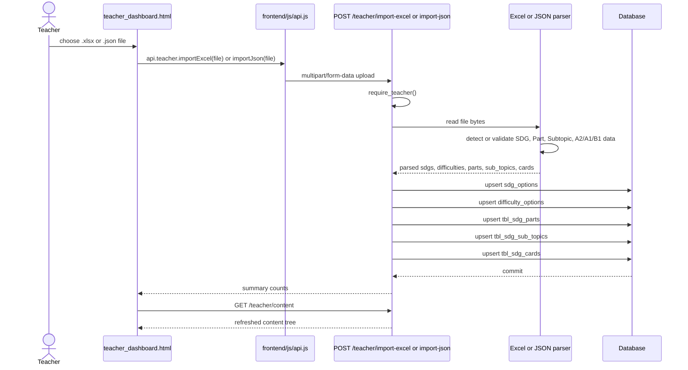

## 9. Teacher Dashboard Architecture

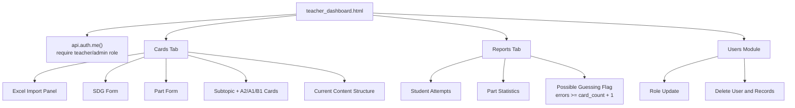

Teacher authorization is enforced server-side by `require_teacher()`, which accepts `teacher` and `admin`. Admin-only protections apply when changing or deleting admin accounts.

## 10. Authentication And Authorization

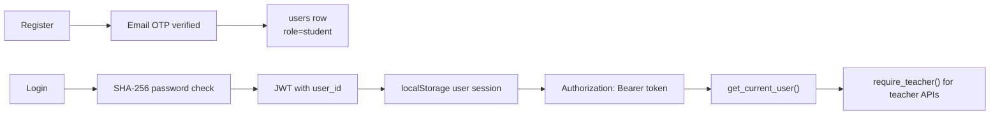

Notes:

- Passwords are hashed with SHA-256 in current code.
- JWT expires after `TOKEN_EXPIRE_DAYS`, currently a long-lived value.
- `auth.requireLogin()` on the frontend redirects unauthenticated users to login with a `next` query string.
- Server permission checks protect game sessions so students can only read/write their own sessions, while teachers/admins can access teacher APIs.

## 11. Rate Limiting

Rate limiting is optional and only active when `REDIS_URL` exists and `RATE_LIMIT_ENABLED` is true.

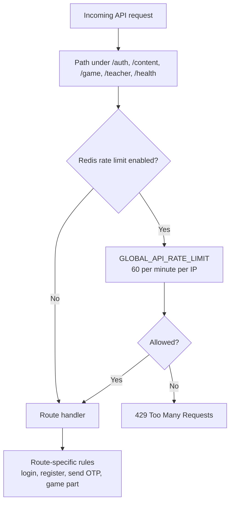

Rules are defined in `backend/rate_limit.py` and enforced in `backend/main.py`.

## 12. Build And Deployment

Local backend:

```bash
uvicorn backend.main:app --reload --host 127.0.0.1 --port 8000
```

Frontend build:

```bash
npm run build
```

The build script:

1. Deletes and recreates `dist/`.
2. Copies `frontend/` to `dist/`.
3. Copies `frontend/` again to `dist/static/`.
4. Writes `dist/config.js` and `dist/static/config.js` from `API_BASE_URL` or `VITE_API_BASE_URL`.

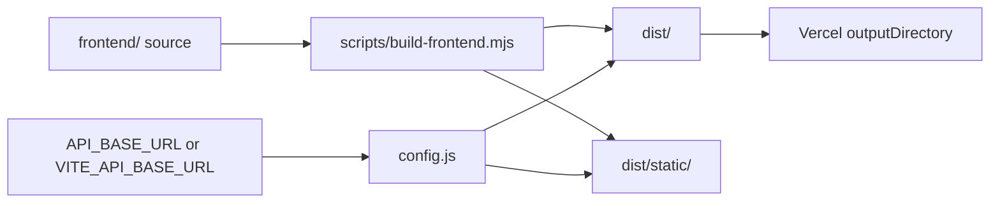

Deployment roles:

- Railway runs `uvicorn backend.main:app --host 0.0.0.0 --port ${PORT:-8000}`.
- Vercel builds `dist/` and serves static frontend files.
- `API_BASE_URL` in Vercel points the static frontend at the Railway backend.

## 13. Configuration

Common environment variables:

| Variable | Purpose |
| --- | --- |
| `DATABASE_URL` | Enables PostgreSQL; otherwise SQLite is used |
| `REDIS_URL` | Enables Redis-backed rate limiting |
| `RATE_LIMIT_ENABLED` | Turns rate limiting on/off |
| `RATE_LIMIT_FAIL_OPEN` | Allows requests if Redis fails when true |
| `SECRET_KEY` | JWT signing secret |
| `FRONTEND_ORIGINS` | Comma-separated CORS allow list |
| `FRONTEND_ORIGIN_REGEX` | Optional CORS regex |
| `API_BASE_URL` | Static frontend runtime API URL during build |
| `VITE_API_BASE_URL` | Alternate frontend API URL env |
| `RESEND_API_KEY` | Resend mail API key |
| `RESEND_FROM` | Resend sender |
| `INITIAL_ADMIN_NAME` | Initial admin display name |
| `INITIAL_ADMIN_EMAIL` | Initial admin email |
| `INITIAL_ADMIN_PASSWORD` | Initial admin password |

## 14. Key Operational Notes

- Edit `frontend/` source first. Rebuild `dist/` after frontend source changes.
- Do not reset or delete `sql/app.db` unless a task explicitly asks for data reset or migration.
- Teacher Excel import is upsert-based, so uploading an updated workbook updates matching SDGs, parts, subtopics, and difficulty cards.
- Finish review intentionally reloads script content from `/game/content` using the current SDG and difficulty, so review text follows the database question bank instead of stale frontend fallback text when DB content exists.
- The local audio recording is downloadable by the student but not stored server-side yet.
- Leaderboard ranks are computed by part, ordered by fewer errors, shorter duration, fewer repeat listens, then earlier start time.
